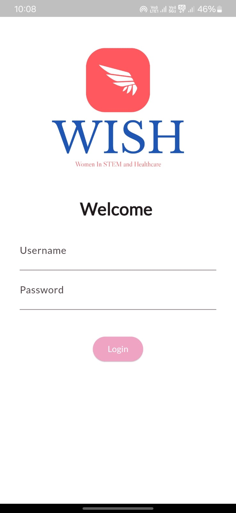
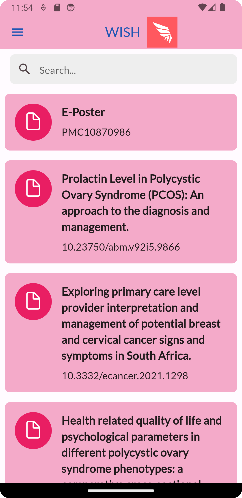
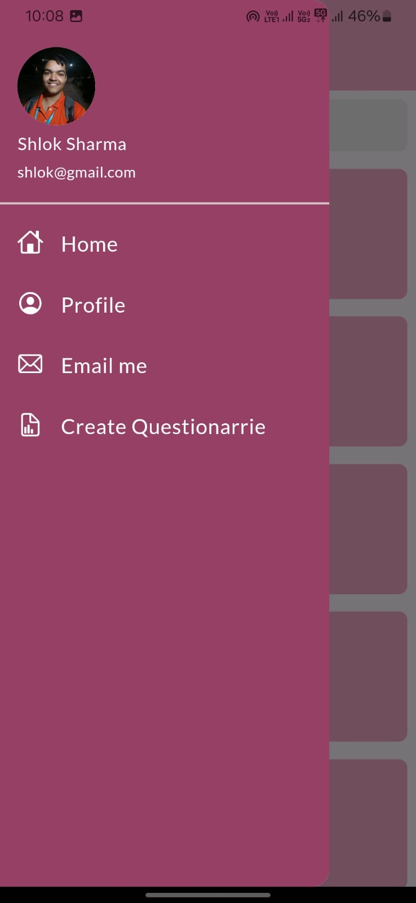
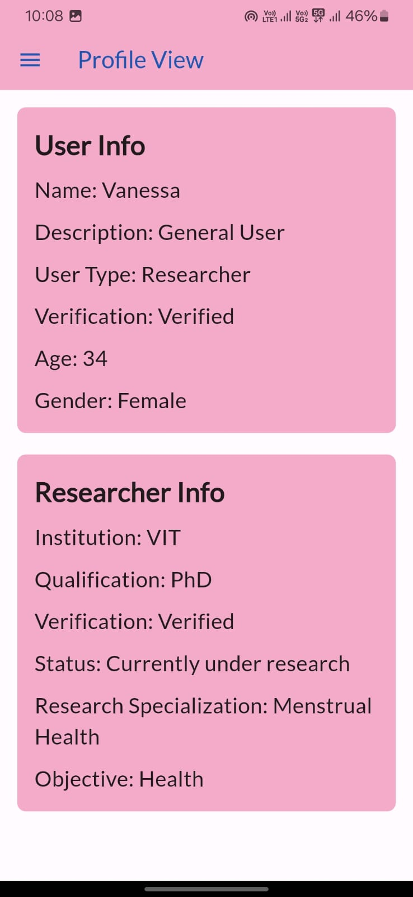

<h1 align="center" id="title">WISH</h1>
<p align="center">

</p>

<p id="description">WISH (Women in STEM and Healthcare) is a groundbreaking app dedicated to advancing research in STEM (Science, Technology, Engineering, and Mathematics) and Healthcare, with a primary objective of spotlighting the contributions of women in these fields. Our platform serves as a hub for accessing and discussing research papers authored by women, offering users a curated selection of insightful studies and findings. By elevating the visibility of female researchers and their work, WISH aims to inspire and empower the next generation of women in STEM and healthcare.</p>
<p>At the core of WISH lies a dynamic and interactive platform where users can engage directly with verified researchers and medical professionals. Through intuitive chat functionalities and online consultations, individuals have the opportunity to seek guidance, ask questions, and engage in meaningful discussions with experts—all within the convenience of the app. Our stringent verification process ensures the authenticity and credibility of both researchers and users. Researchers are meticulously verified through direct communication with their respective institutions, while users undergo verification during the signup process, ensuring a safe and trustworthy environment for collaboration and knowledge exchange on WISH</p>
<p align="center"><i>Promoting Women in STEM And Healthcare</i></p>

<p align="center"></p>
<br>
<h2> 🎥 Demo Video</h2>
<a href="https://www.youtube.com/watch?v=vbWuN2zDp7A">Watch Our Video On YouTube</a>

<h2>Project: </h2>
<br>
<br>

- Login with the credentials used during sign-up.<br>

<br>
- Home page highlighting the trending research papers and allows you to search through them<br>

<br>
-  Sidebar page providing accessibility to all the features available in the app.<br>

<br>

- Profile page of the user showign their details and credentials which are publically visible.<br>


<h2>🧐 Features</h2>

* 🔐 **Firebase & Google Auth:** Secures user data and authentication, ensuring real-time synchronization and robust security.  
* 🧠 **Google Gemini API:** Provides summaries for the research papers we are displaying
* 📝 **pyTesseract for OCR:** Verification of User's Identity to create a safe platform for women.
* ⚡ **FastApi**:Breaks language barriers, offering multilingual support for health documents. 


-  📄 **Data Encryption** All data is encrypted using a symmetric key approach, ensuring that any text file converted to cipher text remains confidential.

-  **🗝 Same Key for Encryption/Decryption:** We employ the same secret key for both encrypting and decrypting data, simplifying key management while maintaining security.

-  **🛡 End-to-End Encryption:** From the moment data is encrypted to the point it is decrypted, it is fully protected, ensuring that sensitive information stays secure during transit and at rest.

-  **🔐 Secure Key Management:** The secret keys are managed securely, ensuring they are inaccessible to unauthorized users and systems.


<h2>🛠️ Installation Steps:</h2>

<p> 1. Prerequisites- 

```
1. Flutter
2. Gemini API key
3. Firebase API key

```
<p>2. Git Clone</p>

```
git clone https://github.com/Death-Raider/WISH.git
```
<br>
<p> 3. Start the Frontend </p>

```
cd wish
flutter run
```
<br>

<p> 4. Setup the Server </p>

```
cd ../api
pip install -r requirements.txt
python app.py
```
<br>

<p> 5. You are <i><u>Good to Go!</u></i> </p>
